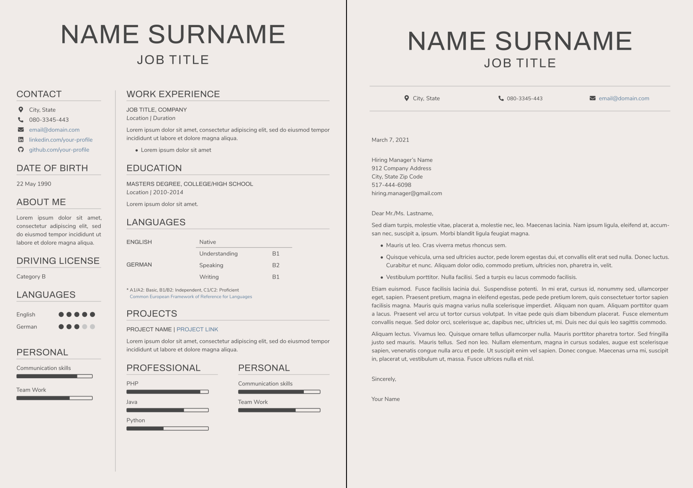
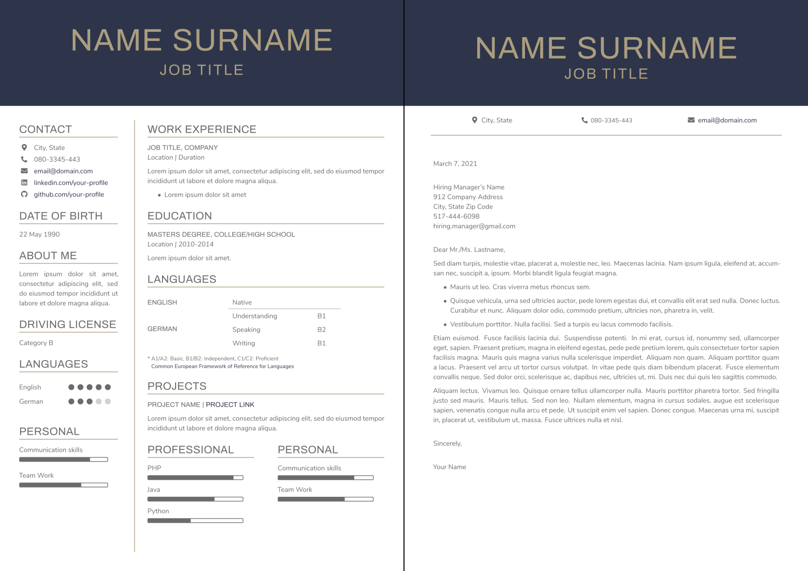
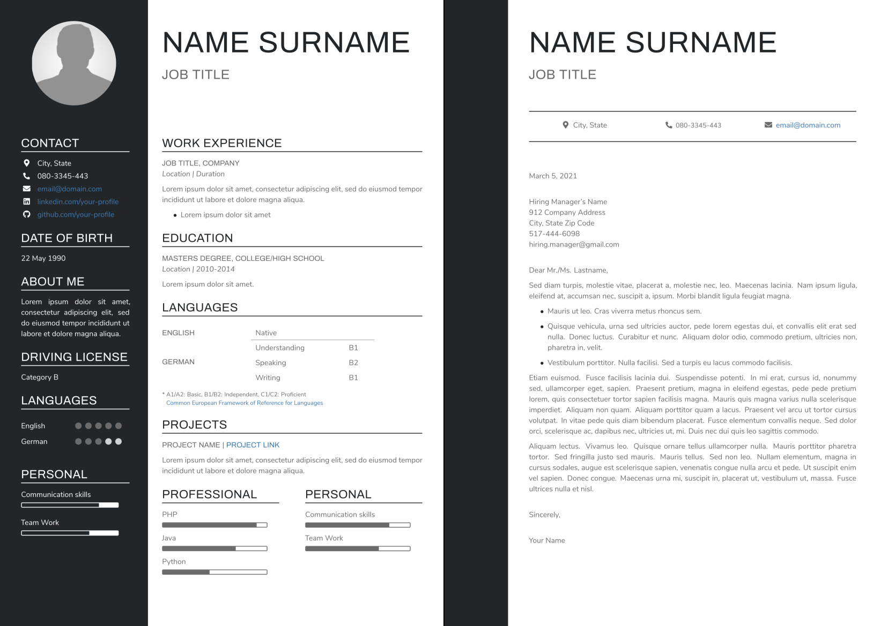
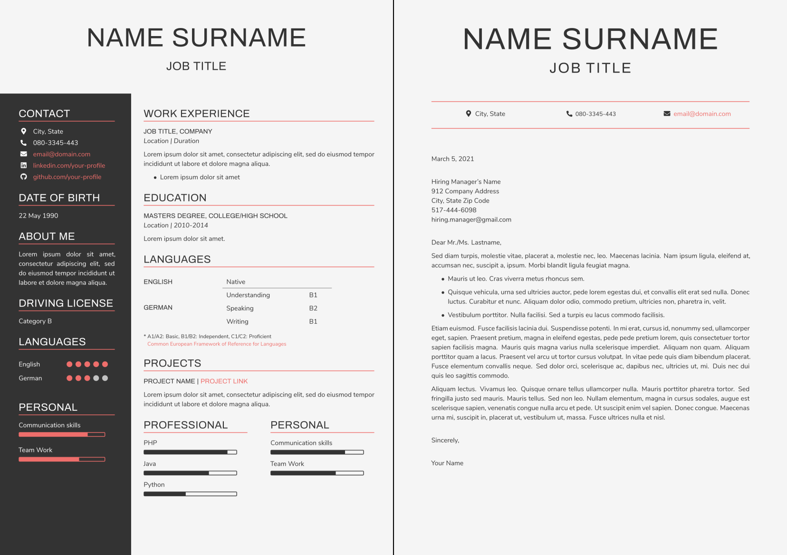
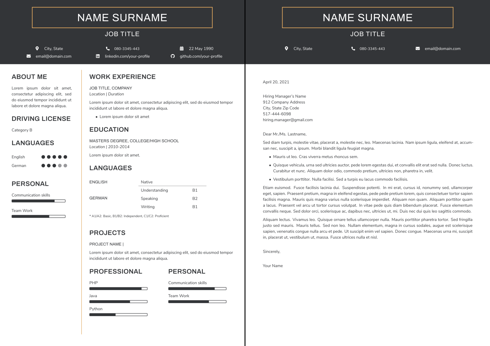
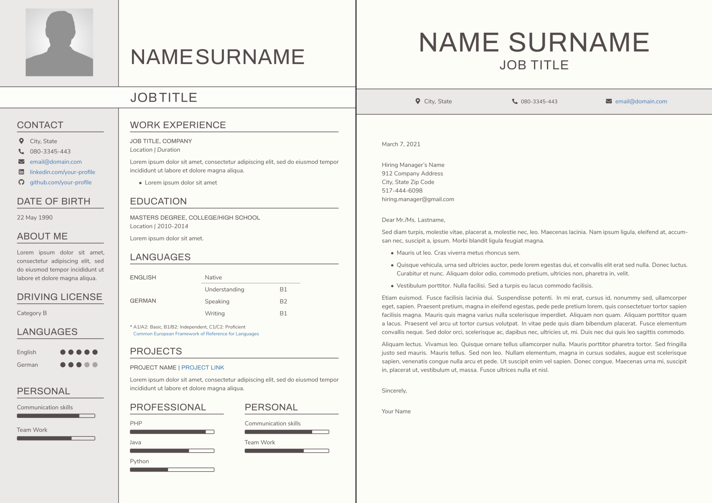
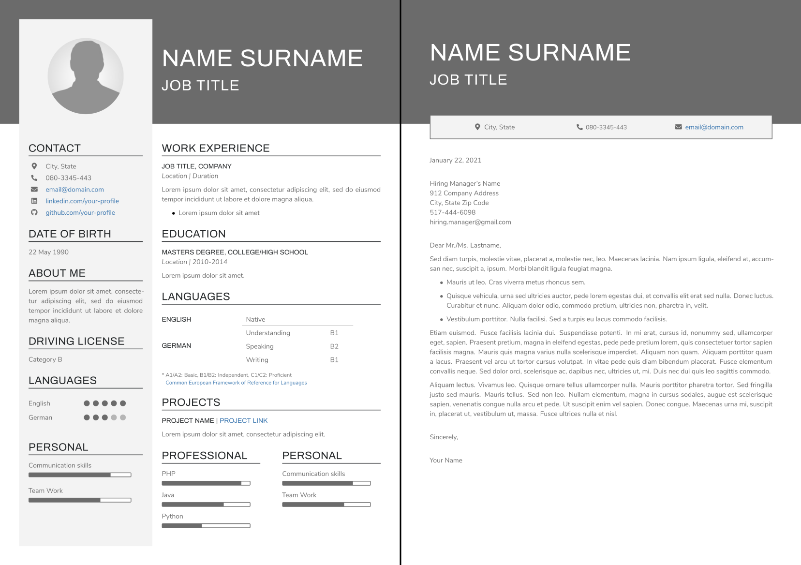
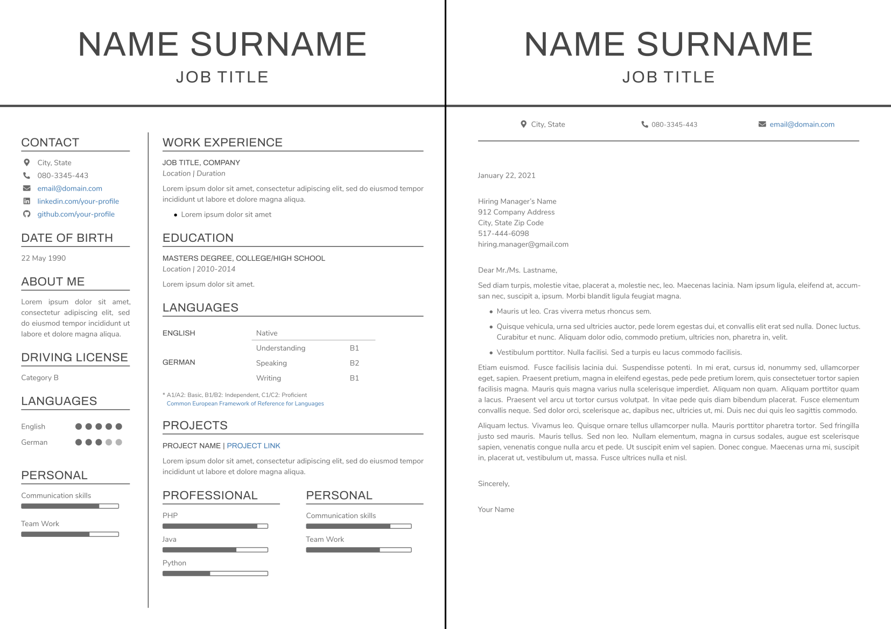
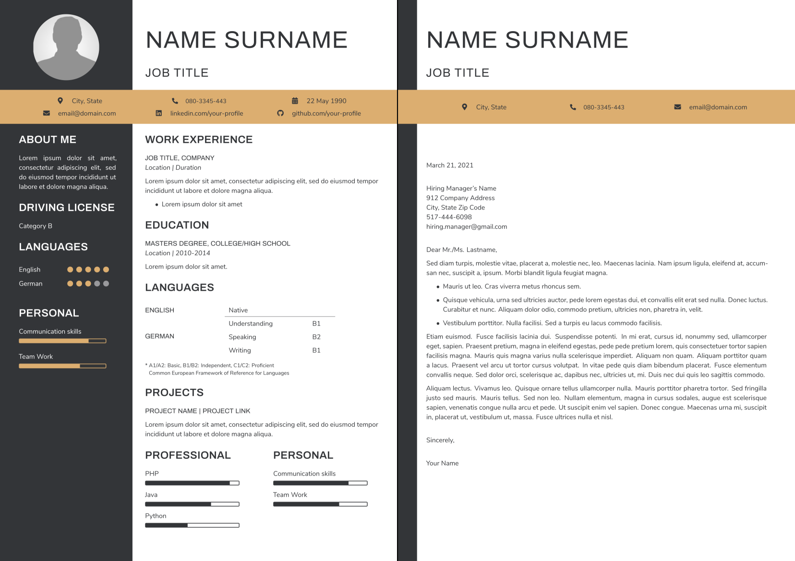
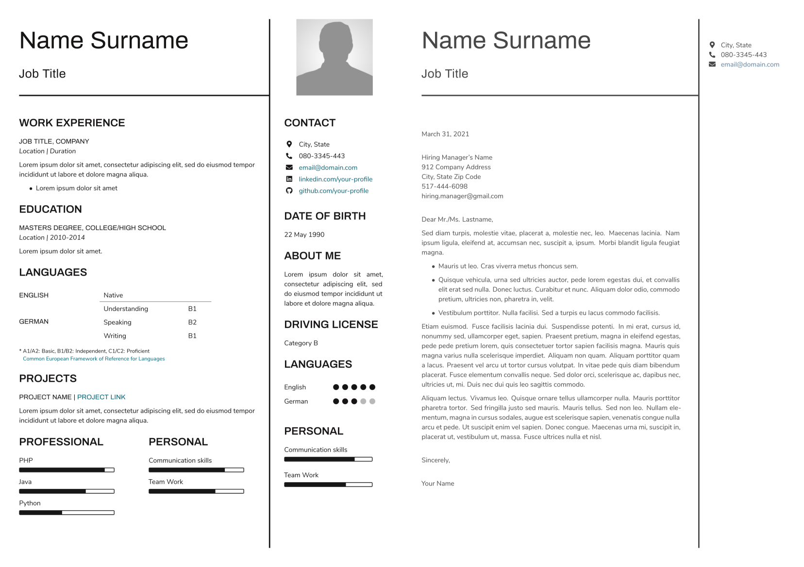

<a href="https://paypal.me/antkr10"></a>

# tex-cvbuilder
tex-cvbuilder is a collection of customizable Curriculum Vitae (CV) &amp; cover letter LaTeX templates. The two main files to edit are `CV-Template.tex` and `Cover-Letter-Template.tex`. 

## Building

### Using Tex Live on your system

The documents are compiled using the XeLaTeX engine. To setup LaTeX on your machine, you will need to install a functional Tex Live distrubution (see [here](https://www.latex-project.org/get/#tex-distributions)). On Ubuntu, the required Tex Live packages are `texlive-fonts-extra` and `texlive-xetex`. To install Tex Live from tug.org, consult [this guide](https://tug.org/texlive/).

Once LaTeX is installed, simply run

```
$ xelatex CV-Template.tex
```

This will generate `CV-Template.pdf`. To build the cover letter, replace `CV-Template.tex` with `Cover-Letter-Template.tex`.

### Using Docker

This repository comes with a Dockerfile for creating a minimal Tex Live installation on top of a Ubuntu image.

To build the image, locate to where you cloned this repository and run

```
$ docker build -t ubuntu:tex-cvbuilder .
```

Once the image is built, compile the document using

```
$ docker run --rm -v $PWD:/tex-cvbuilder ubuntu:tex-cvbuilder bash -c "xelatex CV-Template.tex && xelatex CV-Template.tex"
```

This will generate `CV-Template.pdf`. To build the cover letter, replace `CV-Template.tex` with `Cover-Letter-Template.tex`.

### Using online LaTeX editors

You can also import these files into an online LaTeX editor such as [Overleaf](https://www.overleaf.com/).

## Themes

Cycle through supported themes by changing the `\theme{<theme>}` variable at the beginning of the document. Currently available themes are:

* `beige`
* `blue`
* `bw`
* `coral`
* `earth`
* `framed`
* `gray`
* `minimal`
* `onyx`
* `plain`











